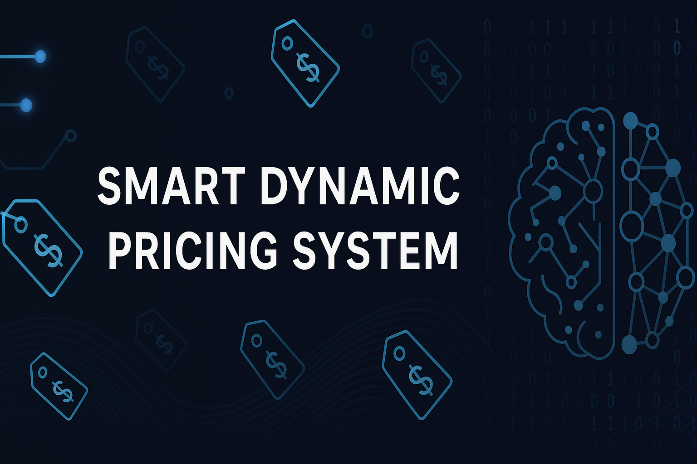
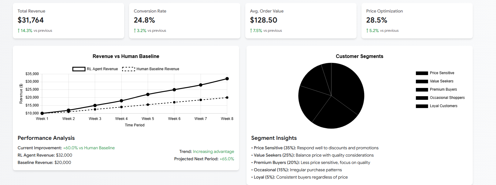
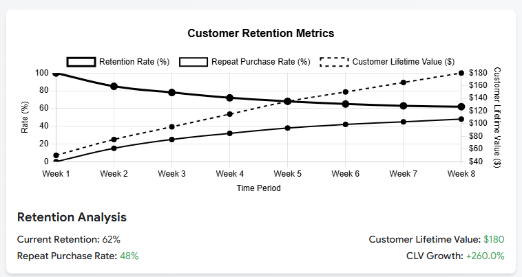

# 🧠 Smart Dynamic Pricing System

A fully modular and production-grade AI-powered pricing engine built using **Deep Reinforcement Learning** to dynamically adjust product prices based on customer behavior, time of day, competition, and market demand.

<p align="center">
  
</p>

---

## 🚀 Project Highlights

- 🎯 **Dueling DQN Agent** for stable and efficient learning  
- 🛒 **Simulated E-commerce Environment** with customer segments, competitor dynamics & time-based pricing  
- 📊 **Human Baseline Comparisons** (Fixed, Adaptive, Time-based, Combined)  
- 🌐 **React Dashboard** to visualize product trends, customer segmentation & agent performance  
- 🔬 **Reward System** to track improvement over human logic  

---

## 🧠 Architecture Overview

```

Frontend (React Dashboard)
↓
Flask API Server
↓
+----------------------+
\|   Dueling DQN Agent  |
\|   Reward System      |
\|   Market Environment |
+----------------------+
↓
Customer Segments, Products, Time-of-Day, Competitor Pricing

```

---

## 📂 Project Structure

```

smart-dynamic-pricing/
│
├── frontend/               # React + Tailwind dashboard
│   ├── src/
│   ├── public/
│   └── …
│
├── backend/                # Flask + DQN model + API
│   ├── enhanced\_api.py
│   ├── enhanced\_agent.py
│   ├── enhanced\_env.py
│   ├── human\_baseline.py
│   └── enhanced\_reward\_system.py
│
├── banner.png              # Project banner
├── dashboard.png           # Dashboard overview screenshot
├── business\_metrics.png    # Business metrics screenshot
└── README.md

````

---

## 🛠️ Setup & Installation

### Frontend

```bash
cd frontend
npm install
npm run dev
````

> Runs at `http://localhost:3000/`

### Backend (Flask API)

```bash
cd backend
pip install -r requirements.txt
python enhanced_api.py
```

> Runs at `http://localhost:5000/`

> **Requirements:** Python 3.8+, Node.js 16+

---

## 📈 Live Dashboard Previews

<p align="center">
  
</p>

<p align="center">
  
</p>

---

## 🧪 How It Works

1. The agent uses a **Dueling Double DQN** to learn pricing strategies.
2. The environment simulates:

   * Time-of-day influence
   * Customer segment preferences
   * Competitor price adjustments
3. The agent is rewarded based on:

   * 💰 Profit earned
   * 📈 Improvement over human baseline strategies
4. All insights are visualized in a user-friendly React frontend.

---

## 📜 License

This project is licensed under the [MIT License](LICENSE).

---

## 🙌 Credits

* **Developer:** Lakshit Mundra
* **Tech Stack:**

  * 🧠 TensorFlow (Deep RL)
  * ⚙️ Flask (API Backend)
  * 🌐 React + Tailwind CSS (Frontend Dashboard)

---

## 🌟 If you found this helpful, please give it a star!

```
```
